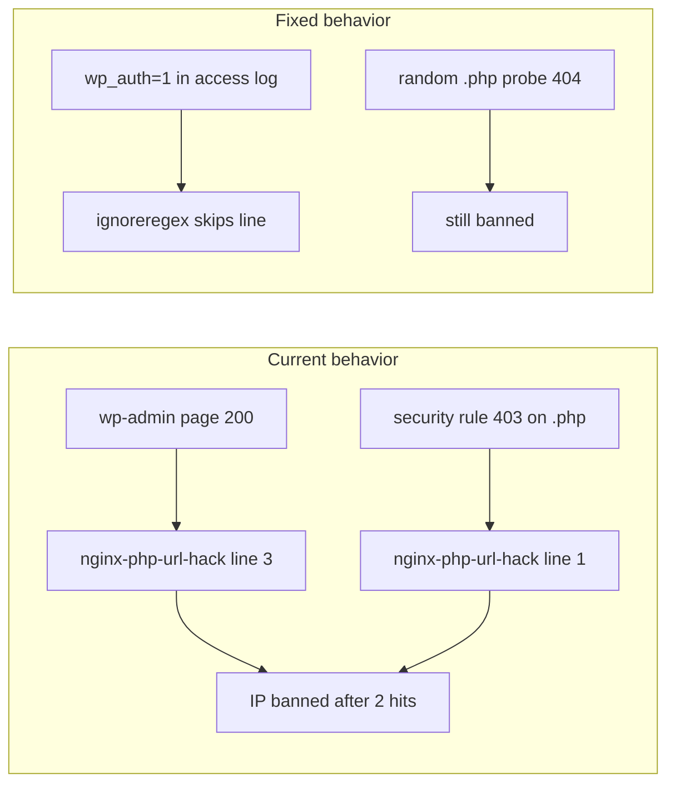

# Fail2Ban: stop banning logged-in WordPress users

## Problem diagnosis

Two custom filters are too aggressive for normal WordPress admin work:

### [`nginx-php-url-hack.conf`](modules/5_security/files/fail2ban/filter/nginx-php-url-hack.conf)

| Line | Pattern | Risk |
|------|---------|------|
| 1 | any `*.php` + **403/404/400** | Logged-in user hitting nginx security blocks (403) or missing plugin files counts as a strike |
| 3 | any `wp-admin*.php` + **any status** | **Critical:** even HTTP **200** admin page loads match — with `maxretry = 2` an editor is banned after 2 normal admin clicks |

### [`non-wordpress-requests.conf`](modules/5_security/files/fail2ban/filter/non-wordpress-requests.conf)

- `failregex` is mostly attack-specific (`.env`, `xmlrpc.php`, SQL injection) — lower risk for editors.
- `ignoreregex` only excludes paths that returned **200**, so a legitimate `/wp-admin/...` or `/wp-json/...` request that returns **403/504** is **not** exempt.

### 504 status

Neither filter matches **502/503/504** today. The real ban trigger for editors is **403** (and line 3 matching successful wp-admin loads). We will **not** add gateway timeout codes to `failregex`.



---

## Solution (cookie-aware logging + filter hardening)

You chose the **cookie-aware** approach: append a login flag to nginx access logs and teach Fail2Ban to ignore those lines.

### 1. Nginx: map cookie → log field

Add [`modules/5_security/files/nginx/wp-fail2ban-log.conf`](modules/5_security/files/nginx/wp-fail2ban-log.conf):

```nginx
map $http_cookie $wp_auth_log {
    default "0";
    "~*wordpress_logged_in" "1";
}

log_format main_wp '$remote_addr - $remote_user [$time_local] "$request" '
    '$status $body_bytes_sent "$http_referer" '
    '"$http_user_agent" "$http_x_forwarded_for" wp_auth=$wp_auth_log';
```

Update provision template [`modules/1_nginx-php/files/nginx.conf`](modules/1_nginx-php/files/nginx.conf) (and mirror in [`configs/nginx-ssl.conf`](configs/nginx-ssl.conf)):

- Include the map (inline or via `include /etc/nginx/conf.d/wp-fail2ban-log.conf`)
- Switch `access_log` from `main` → `main_wp`

**Existing hosts:** extend [`modules/5_security/playbook-fail2ban.yml`](modules/5_security/playbook-fail2ban.yml) to:

1. Copy `wp-fail2ban-log.conf` → `/etc/nginx/conf.d/`
2. Replace `access_log ... main` → `main_wp` in `/etc/nginx/nginx.conf` (lineinfile with backup)
3. `nginx -t` then reload nginx **before** reloading fail2ban

Log lines gain a trailing field: `wp_auth=0` (anonymous) or `wp_auth=1` (logged in). Old log lines without the field remain readable; they simply won't match the new ignoreregex.

### 2. Fix [`nginx-php-url-hack.conf`](modules/5_security/files/fail2ban/filter/nginx-php-url-hack.conf)

**Remove** line 3 (wp-admin catch-all — root cause of admin bans).

**Narrow** line 1 to **404 only** (scanner probing random `.php` paths):

```ini
failregex = ^<HOST> - .* "(GET|POST|HEAD) .*\.php.*" 404 .*$
            ^<HOST> - .* "(GET|POST|HEAD) .*shell.*\.php.*" .*$
ignoreregex = ^.* wp_auth=1 .*$
```

Keep the explicit `shell*.php` line (any status) — still attack-specific.

### 3. Fix [`non-wordpress-requests.conf`](modules/5_security/files/fail2ban/filter/non-wordpress-requests.conf)

Add cookie ignoreregex and broaden path exemptions to **any status** (defense in depth when cookie missing, e.g. REST API token auth):

```ini
ignoreregex = ^.* wp_auth=1 .*$
              ^<HOST> -.*"(GET|POST|HEAD) /(wp-admin|wp-login\.php|wp-content|wp-includes|admin-ajax\.php|index\.php|wp-cron\.php|wp-json).*"
```

Remove the `200`-only suffix from the path-based line.

Keep existing `failregex` attack patterns unchanged (including `xmlrpc.php` and `wp-login.php` POST failures for **unauthenticated** brute-force).

### 4. Playbook validation tasks

Add post-deploy checks to [`playbook-fail2ban.yml`](modules/5_security/playbook-fail2ban.yml):

```bash
# Must NOT match (logged-in admin 403)
fail2ban-regex /var/log/nginx/access.log \
  /etc/fail2ban/filter.d/nginx-php-url-hack.conf \
  --print-all-matched

# Synthetic line test (in task or docs)
echo '1.2.3.4 - - [date] "GET /wp-admin/post.php HTTP/1.1" 403 ... wp_auth=1' | \
  fail2ban-regex - /etc/fail2ban/filter.d/nginx-php-url-hack.conf
# Expected: 0 matched (ignoreregex)
```

Reload order: **nginx → fail2ban** (`fail2ban-client reload`).

### 5. Deploy

```bash
ansible-playbook -i 'lifeimaging,' modules/5_security/playbook-fail2ban.yml \
  -e ansible_host=13.54.18.208 ansible_ssh_private_key_file=~/.ssh/lifeimaging.pem
```

Verify on host:

```bash
sudo tail -3 /var/log/nginx/access.log          # confirm wp_auth= field
sudo fail2ban-client status nginx-php-url-hack
sudo fail2ban-client status nginx-non-wordpress
```

Unban any wrongly blocked IP: `sudo fail2ban-client set nginx-php-url-hack unbanip <IP>`.

---

## Files changed

| File | Change |
|------|--------|
| [`modules/5_security/files/nginx/wp-fail2ban-log.conf`](modules/5_security/files/nginx/wp-fail2ban-log.conf) | **new** — cookie map + `main_wp` log format |
| [`modules/1_nginx-php/files/nginx.conf`](modules/1_nginx-php/files/nginx.conf) | use `main_wp` for new provisions |
| [`configs/nginx-ssl.conf`](configs/nginx-ssl.conf) | mirror log format change |
| [`modules/5_security/files/fail2ban/filter/nginx-php-url-hack.conf`](modules/5_security/files/fail2ban/filter/nginx-php-url-hack.conf) | remove wp-admin line; 404-only; cookie ignoreregex |
| [`modules/5_security/files/fail2ban/filter/non-wordpress-requests.conf`](modules/5_security/files/fail2ban/filter/non-wordpress-requests.conf) | cookie + path ignoreregex (any status) |
| [`modules/5_security/playbook-fail2ban.yml`](modules/5_security/playbook-fail2ban.yml) | deploy nginx snippet, patch access_log, validation |

No change to [`jail.local`](modules/5_security/files/fail2ban/jail.local) thresholds unless post-deploy testing shows false positives remain.

---

## Out of scope / explicit non-goals

- Do **not** add 502/503/504 to failregex (would ban users during PHP-FPM saturation).
- Do **not** change Ohara/Elementor tuning playbooks — this is a security-module fix only.
- REST/API clients without `wordpress_logged_in` cookie still rely on path-based ignoreregex for `/wp-json` and `/wp-admin`.
