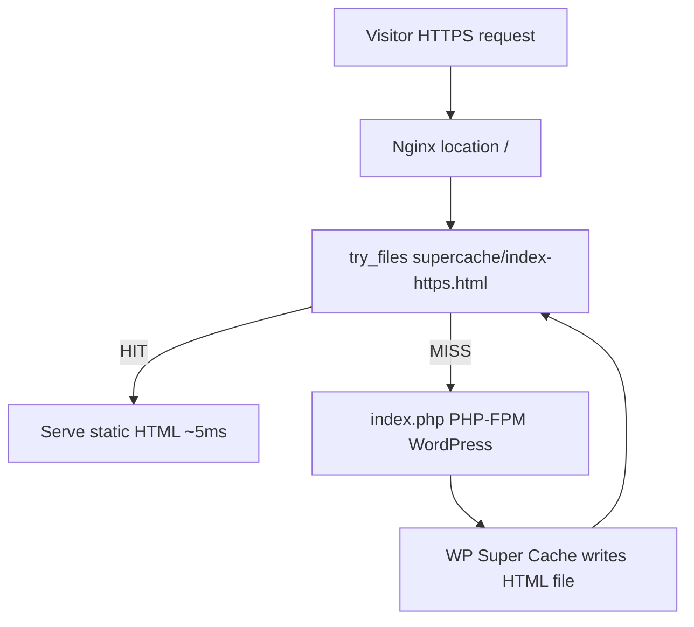

# WP Super Cache Expert Mode — lifeimaging nginx plan

## Problem

WP Super Cache is already in **Expert mode** on the server (`$wp_cache_mod_rewrite = 1` in `wp-cache-config.php`) and is generating static files, e.g.:

```
/usr/share/nginx/html/wp-content/cache/supercache/lifeimaging.com.au/index-https.html
/usr/share/nginx/html/wp-content/cache/supercache/lifeimaging.com.au/book-online-page/index-https.html
```

But nginx still uses the default WordPress fallback only:

```nginx
location / {
    try_files $uri $uri/ /index.php?$args;
}
```

Expert mode requires the **web server** to check for supercache HTML **before** PHP. Without that, Expert mode appears inactive in practice even though the plugin UI shows it enabled.



## Reference pattern (already proven in this repo)

Reuse the approach documented in [docs/cccsl/cache-optimization.md](docs/cccsl/cache-optimization.md) and [configs/nginx-ssl.conf](configs/nginx-ssl.conf):

- `$cache_uri` bypass rules (POST, query string, cookies, admin paths)
- `$wpsc_path` homepage fix (`/` → empty path so nginx looks for `lifeimaging.com.au/index-https.html`, not `lifeimaging.com.au//index-https.html`)
- `try_files` supercache lookup **before** `$uri` and `/index.php`

## Recommended config for this server

### 1. Add `/etc/nginx/default.d/supercache.conf`

New file with bypass variables + canonical host mapping:

```nginx
# Canonical cache host (files live under lifeimaging.com.au only)
map $http_host $wpsc_host {
    default                 lifeimaging.com.au;
    www.lifeimaging.com.au  lifeimaging.com.au;
    lifeimaging.com.au      lifeimaging.com.au;
}

set $cache_uri $request_uri;

if ($request_method = POST) { set $cache_uri 'null cache'; }
if ($query_string != "") { set $cache_uri 'null cache'; }

if ($request_uri ~* "(/wp-admin/|/xmlrpc.php|/wp-(app|cron|login|register|mail).php|wp-.*\.php|/feed/|index\.php|wp-comments-popup\.php|wp-links-opml\.php|wp-locations\.php|sitemap(_index)?\.xml|[a-z0-9_-]+-sitemap([0-9]+)?\.xml)") {
    set $cache_uri 'null cache';
}

if ($http_cookie ~* "comment_author|wordpress_[a-f0-9]+|wp-postpass|wordpress_logged_in") {
    set $cache_uri 'null cache';
}

# Homepage path fix (cccls pattern)
set $wpsc_path $cache_uri;
if ($wpsc_path = /) { set $wpsc_path ""; }

# Serve pre-compressed supercache if present
location ~ ^/wp-content/cache/supercache/.+\.html(\.gz)?$ {
    gzip_static on;
    add_header Cache-Control "public, max-age=3600" always;
    add_header X-Super-Cache "nginx-static" always;
}
```

Notes for this site:
- **Gravity Forms** / form submissions: already safe because WP Super Cache has “Don't cache pages with GET parameters” enabled and POST/query-string bypasses above match plugin settings in your screenshots.
- **Logged-in users**: `$wp_cache_not_logged_in = 2` + cookie bypass — admin/editor sessions always hit PHP.

### 2. Update `/etc/nginx/nginx.conf` `location /`

Replace the current block inside the HTTPS `server { ... }` with:

```nginx
location / {
    try_files /wp-content/cache/supercache/$wpsc_host$wpsc_path/index-https.html
              $uri $uri/ /index.php$is_args$args;
    add_header Cache-Control "public, max-age=3600" always;
}
```

Use `/index.php$is_args$args` (not `?$args`) so plugins that rely on query args still work on cache miss ([GetPageSpeed guidance](https://www.getpagespeed.com/server-setup/wp-super-cache-nginx-configuration)).

### 3. Remove redundant FastCGI cache (best for 1 GB RAM)

Yesterday we added a second cache layer on `location = /index.php` in `/etc/nginx/default.d/security.conf` plus `/etc/nginx/conf.d/fastcgi_cache_file.conf`. With Expert mode, that layer is **mostly redundant** and costs RAM (`PAGES` zone + `/var/cache/nginx/pages`).

**Recommended:** remove FastCGI cache directives from `security.conf`, delete `fastcgi_cache_file.conf` and `fastcgi_cache_skip.conf`, reload nginx.

Result: one clear cache path — static supercache HTML on hit; PHP only on miss.

### 4. Tune WP Super Cache PHP settings (small, durable)

In `/usr/share/nginx/html/wp-content/wp-cache-config.php` (backup first):

| Setting | Current | Recommended |
|---------|---------|-------------|
| `$cache_max_time` | `1800` (30 min) | `86400` (24 h) — matches cccls, fewer regenerations |
| `$wp_cache_mod_rewrite` | `1` | keep `1` |
| `$cache_compression` | `1` | keep `1` (works with `gzip_static`) |

No UI change needed for Expert mode — it is already selected.

### 5. Purge and warm cache after nginx reload

```bash
sudo -u ec2-user wp cache flush --path=/usr/share/nginx/html
curl -sI https://lifeimaging.com.au/ -k | grep -iE 'HTTP/|x-super|cache-control'
curl -sI https://lifeimaging.com.au/ -k | grep -iE 'HTTP/|x-super|cache-control'   # 2nd request should HIT
curl -s https://lifeimaging.com.au/book-online-page/ -o /dev/null
curl -s https://lifeimaging.com.au/bateau-bay-radiology/ -o /dev/null
```

**Success criteria:**
- First request after purge: no `X-Super-Cache` or MISS path via PHP
- Second request: `X-Super-Cache: nginx-static` and ~5–80 ms TTFB
- Logged-in `/wp-admin/` still works (cookie bypass)
- Forms/booking pages with query strings bypass cache and hit PHP

### 6. Optional repo follow-up (not required for go-live)

Add a reusable snippet under `snippets/supercache-nginx.conf` and a short `docs/lifeimaging-cache.md` mirroring [docs/cccsl/cache-optimization.md](docs/cccsl/cache-optimization.md) so future Lightsail 1 GB hosts get the same pattern via Ansible/SSH.

## What we will NOT do

- **Cloudflare** — you noted AWS-only; nginx static supercache is the right substitute.
- **Change security hardening** in [modules/5_security/files/fail2ban/jail.local](modules/5_security/files/fail2ban/jail.local) — unrelated to cache delivery.
- **Raise PHP-FPM further** — swap + `max_children=3` already applied; Expert mode reduces PHP load significantly.

## Risk / rollback

- Back up `nginx.conf`, `security.conf`, and `wp-cache-config.php` before edits (same pattern as prior lifeimaging changes).
- If a page misbehaves, bypass is usually query string or cookie — test in incognito without cookies.
- Rollback: restore old `location /`, remove `supercache.conf`, reload nginx.
