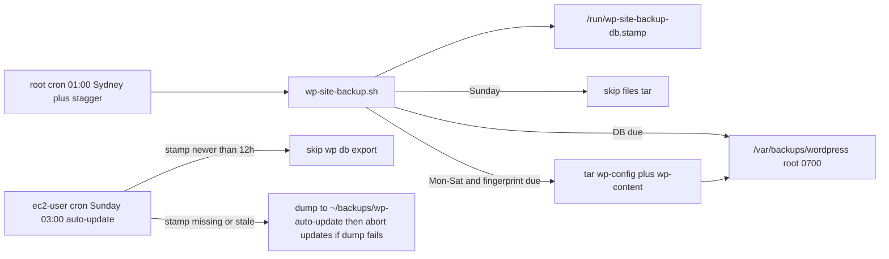

# Independent WordPress backups (no UpdraftPlus)

Drop the backup plugins. They live in the docroot, so a stolen wp-admin (or a webshell as `ec2-user`) can delete the plugin, change retention to 1, or unlink `wp-content/updraft/`. PHP-FPM is `user = ec2-user` in [modules/1_nginx-php/playbook.yml](modules/1_nginx-php/playbook.yml).

Replace them with a **root cron** that writes to **`/var/backups/wordpress/`** (`root:root`, `0700`). That path is outside every web root this fleet uses (`/home/ec2-user/html`, `/var/www/html`, `/usr/share/nginx/html`).

New provisions: stop installing the plugins in [modules/2_wordpress/playbook.yml](modules/2_wordpress/playbook.yml) (it currently installs **both** WPvivid and UpdraftPlus). Live hosts: delete any files under `wp-content/updraft/` and `wp-content/wpvividbackups/` (do **not** copy them to `/var/backups/wordpress`), then uninstall the plugins.



## Do not dump twice with module 8 auto-update

[modules/8_updates/playbook-wp.yml](modules/8_updates/playbook-wp.yml) already installs an **ec2-user** cron: `0 3 * * 0` Australia/Sydney. [run-wp-auto-update.sh](modules/8_updates/files/run-wp-auto-update.sh) always calls `backup_database` first (`wp db export` → `/home/ec2-user/backups/wp-auto-update/*_pre-update_*.sql.gz`, keep 28 days) and **aborts updates if that dump fails**. That is a rollback copy for plugin/core updates, not the compromise-recovery copy. Without coordination, Sunday would dump the same database twice: backup cron ~01:00, auto-update 03:00.

Rules:

1. **One MySQL dump on Sunday.** Backup cron runs **before** auto-update (`01:00` + 0–45 min stagger, always done by 02:00). After a successful DB dump it writes `/run/wp-site-backup-db.stamp` (mode `0644`, timestamp + dump path). Auto-update can read that file; it cannot read `/var/backups/wordpress`.
2. **Change `backup_database` in `run-wp-auto-update.sh`:** if the stamp exists and is newer than **12 hours**, log `Skip: fresh dump from wp-site-backup` and continue to updates. Do **not** run `wp db export` again. If the stamp is missing or stale (backup cron not installed, or dump failed), keep today's behaviour: dump to `/home/ec2-user/backups/wp-auto-update/` and abort updates on failure. `WP_AUTO_UPDATE_BACKUP=0` still disables even the fallback.
3. **Skip the files tar on Sunday.** Auto-update at 03:00 changes plugins/themes/core, so a 01:00 files archive would be stale within two hours and the fingerprint would trigger another tar Monday anyway. Files backups run **Monday–Saturday** only. After Sunday updates, Monday's run sees the new fingerprint and takes one post-update archive.
4. **Shared lock.** Backup uses `flock` on `/var/backups/wordpress/.lock`. Auto-update already flocks `/tmp/wp-auto-update.lock`. Each script must skip (or wait up to a few minutes) if the **other** lock is held, so a slow dump never overlaps `wp plugin update`.
5. **Do not point auto-update's `WP_AUTO_UPDATE_BACKUP_DIR` at `/var/backups/wordpress`.** That directory is `root:root` `0700`; the update job runs as `ec2-user` and cannot write there. Two destinations on purpose: recovery vs update-rollback. Only the dump **command** is deduplicated.

Leave [playbook-wp.yml](modules/8_updates/playbook-wp.yml) schedule at Sunday 03:00. Document the skip in [modules/8_updates/README.md](modules/8_updates/README.md).

## Smart scheduler (inside the script, not WP-Cron)

Nightly **root** cron, `CRON_TZ=Australia/Sydney`, base `0 1 * * *` (01:00, before Sunday auto-update). Same installer pattern as [modules/8_updates](modules/8_updates/README.md). Not WP-Cron, not PHP-FPM, not Action Scheduler.

The script decides whether a run is needed:

| Check | Result |
| --- | --- |
| Other lock held (`/tmp/wp-auto-update.lock` or backup flock) | Skip or wait briefly; never dump while updates run |
| Free space | Abort if free is under 500MB or under 1.5× the last archive size (small Ohara disks) |
| Database | Dump if the newest `*_db_*.sql.gz` in `/var/backups/wordpress` is missing or older than **7 days**. Sunday 01:00 normally takes this dump; Mon–Sat no-op. |
| Files | **Skip on Sunday** (weekday 0, Sydney). Other days: archive if newest `*_files_*.tar.gz` is missing, older than **14 days**, or the wp-content fingerprint changed |
| Otherwise | Log `nothing due` and exit 0 |

Fingerprint (cheap, no full tar): sorted `path size mtime` of `wp-content/{uploads,plugins,themes,mu-plugins}`, excluding `cache`, `upgrade`, `updraft`, `wpvividbackups`, `tmp`. SHA-256 stored next to the last files archive. Quiet hotel sites skip the heavy tar most nights.

**Per-host stagger:** add `(cksum of hostname % 45)` minutes to 01:00 so the Ohara fleet does not dump the shared remote MySQL (`152.69.175.15`) at the same second, and every host still finishes before 03:00.

`nice -n 19` and `ionice -c2 -n7` on dump and tar (same as [bash/database/backup-pyrocms.sh](bash/database/backup-pyrocms.sh)).

Cadence if content keeps changing: weekly DB (Sunday, once), fortnightly files (not on Sunday), retain **5** DB dumps and **4** file archives (same as the Updraft Settings screenshot).

## What is backed up (not the full website)

Do **not** tar the whole docroot. Core (`wp-admin`, `wp-includes`, root PHP such as `index.php` / `wp-login.php`) is stock from wordpress.org on every host and is restored with `wp core download --version=…`. Archiving it wastes I/O and disk on 512MB–1GB Ohara boxes, and after a compromise you want clean core rather than a webshell restored from `wp-admin`.

Each files archive is `wp-config.php` + `wp-content/` only:

| Include | Why |
| --- | --- |
| Database dump | Posts, Elementor, users, options |
| `wp-config.php` | DB creds, salts, `DISABLE_WP_CRON`, memory/autosave constants — **not** inside `wp-content` |
| `wp-content/` | Plugins, themes, uploads, mu-plugins |

| Exclude | Why |
| --- | --- |
| `wp-admin/`, `wp-includes/`, root WP PHP | Reinstall matching core |
| `wp-content/cache`, `upgrade`, `tmp`, `debug.log` | Regenerable / noise |
| `wp-content/updraft`, `wpvividbackups` | Legacy plugin archives — delete on install; excluded from tar |
| `/etc/nginx`, Let’s Encrypt, PHP-FPM | Already outside the site tree; not this job |

Nginx, PHP, and certs stay out of this tarball. A one-off file in the docroot root (`robots.txt`, a Search Console HTML file) can be added later as an extra include; that is cheaper than archiving core on every host every fortnight.

## What the backup script does

New [modules/9_backup/files/wp-site-backup.sh](modules/9_backup/files/wp-site-backup.sh), installed to `/usr/local/bin/wp-site-backup.sh`, owned by root, mode `0750`.

- Detect docroot the same way as [modules/8_updates/files/run-wp-auto-update.sh](modules/8_updates/files/run-wp-auto-update.sh): `/home/ec2-user/html`, then `/usr/share/nginx/html`, then `/var/www/html`. Honor `wp_root` when Ansible sets it.
- Refuse to write if the destination is inside the web root or under `wp-content` (reuse the `backup_outside_webroot` check).
- **Database:** `sudo -u ec2-user /usr/local/bin/wp db export - --path="$WP_ROOT"` piped to gzip. Remote MySQL; many hosts have no `mysqldump` after provision (the WordPress playbook removes the client). No `--allow-root`. On success, write `/run/wp-site-backup-db.stamp` (0644) so [run-wp-auto-update.sh](modules/8_updates/files/run-wp-auto-update.sh) can skip a second dump.
- **Files:** from the docroot, `tar` of `wp-config.php` and `wp-content/`, excluding cache, upgrade, tmp, `updraft`, `wpvividbackups`, `debug.log`. Paths in the archive stay relative (`wp-config.php`, `wp-content/...`) so restore is extract-in-place. Do not include `wp-admin` or `wp-includes`. Write a sidecar `*_files_*.version` with `wp core version` so restore knows which core to download. **Not on Sunday** (see module 8 coordination).
- After each successful archive: `chmod 600`, `chattr +i`. Retention does `chattr -i` then `rm`.
- Log: `/var/log/wp-site-backup.log`.
- Skip non-WordPress hosts (`capitalformwork`, `lwhydraulics`, `figtreesports`).

Restore is documented in the module README (no wp-admin restore UI):

1. `wp core download --version=<from dump or wp-config>` into an empty/clean docroot
2. Extract the files archive so `wp-config.php` and `wp-content/` land in that docroot
3. `gunzip -c *_db_*.sql.gz | wp db import - --path=...` as `ec2-user`

Sunday 01:00 dump in `/var/backups/wordpress` is the pre-update rollback for that week's auto-update **and** the weekly recovery copy. `/home/ec2-user/backups/wp-auto-update/` is used only when the stamp is missing (backup cron not on that host yet).

## Remove the plugins

**New provisions** — delete these tasks from [modules/2_wordpress/playbook.yml](modules/2_wordpress/playbook.yml):

- `Install WPvivid Backup Plugin`
- `Install UpdraftPlus Backup/Restore Plugin`

WPvivid has the same failure mode (archives under `wp-content/wpvividbackups`, see [modules/tools/scripts/remove-old-backup.sh](modules/tools/scripts/remove-old-backup.sh)). Do not leave it as a second in-tree backup.

Comment in [modules/1_nginx-php/snippets/php-webshell-hardening.yml](modules/1_nginx-php/snippets/php-webshell-hardening.yml) currently says backup plugins fall back to PHP zip if `exec` is disabled. Update that comment; backups will not go through FPM.

**Live hosts** (after the root backup dir and cron exist):

1. Remove all files under `wp-content/updraft/` and `wp-content/wpvividbackups/` if those dirs exist (`rm -rf` contents, then remove empty dirs). Do **not** copy or move them to `/var/backups/wordpress/imported/` or anywhere else — recovery is only from the new root cron backups going forward.
2. `wp plugin deactivate updraftplus wpvivid-backuprestore` then `wp plugin uninstall ...` as `ec2-user`.
3. Do not `chattr` anything under the docroot.

No must-use lock plugin. No `DISALLOW_FILE_MODS`. Nothing in wp-admin to tamper with.

## How it gets onto hosts

All of this lives in the repo (not only `.cursor/plans`):

| Path | Role |
| --- | --- |
| [modules/9_backup/files/wp-site-backup.sh](modules/9_backup/files/wp-site-backup.sh) | Backup + scheduler + stamp |
| [modules/9_backup/files/install-wp-site-backup-cron.sh](modules/9_backup/files/install-wp-site-backup-cron.sh) | Root crontab installer |
| [modules/9_backup/playbook.yml](modules/9_backup/playbook.yml) | Deploy dir, script, cron; optional `--extra-vars` to uninstall plugins |
| [modules/9_backup/README.md](modules/9_backup/README.md) | Deploy, schedule, restore, overlap with module 8 |
| [modules/8_updates/files/run-wp-auto-update.sh](modules/8_updates/files/run-wp-auto-update.sh) | Skip `wp db export` when stamp is fresh |
| [bash/install-wp-site-backup.sh](bash/install-wp-site-backup.sh) | Wrapper like [bash/install-os-upgrade-cron.sh](bash/install-os-upgrade-cron.sh) |
| Root [README.md](README.md) | Link to module 9 as a post-WordPress step |

Live fleet: Ansible playbook (or the bash wrapper) with `SSH_CONFIG` / inventory. Do not retune the WordPress playbook for a single host; removing the plugin install is the new default for **all** new provisions.

```bash
ansible-playbook -i inventory/ohara-hotels.ini modules/9_backup/playbook.yml --limit station
```

## What this does not stop

- Root on the VM can still destroy `/var/backups/wordpress`. Same-disk copies are not Object Lock / off-site.
- They can still deface the live site; this only preserves a restore point.
- `ec2-user` can still `sudo` on some Lightsail images — if sudo is passwordless to root, the 0700 dir is not a security boundary. Worth checking on the first test host.

## Verify on one host first

Pick one Ohara WordPress host (not `capitalformwork` / `lwhydraulics` / `figtreesports`):

- `wp plugin is-installed updraftplus` is false
- `wp-content/updraft/` and `wp-content/wpvividbackups/` absent or empty (legacy archives deleted, not imported)
- `sudo -u nginx ls /var/backups/wordpress` fails (Permission denied)
- First `sudo /usr/local/bin/wp-site-backup.sh` writes `*_db_*.sql.gz` and (if not Sunday) `*_files_*.tar.gz`, plus `/run/wp-site-backup-db.stamp`
- `tar -tzf` on the files archive lists `wp-config.php` and `wp-content/` only — no `wp-admin/` or `wp-includes/`
- Immediate second run logs `nothing due` (or skips files if fingerprint matches)
- `WP_AUTO_UPDATE_DRY_RUN=1 ~/bin/run-wp-auto-update.sh` logs skip dump when the stamp is fresh; with the stamp removed it still plans a dump to `~/backups/wp-auto-update/`
- `lsattr` shows `i` on finished archives
- Site still serves HTTP 200
