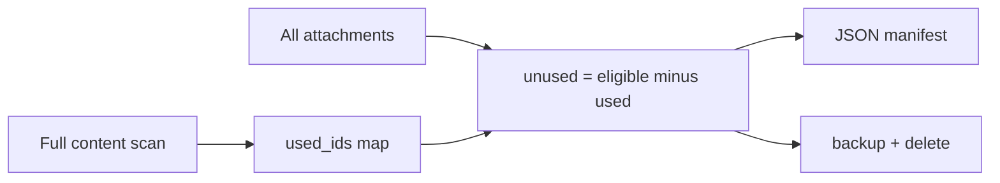

# Used-media index design

## Verdict

**Best idea:** keep a small **JSON index of used attachment IDs + sources** on the host (outside webroot), rebuild it with a **content-hash incremental scan**, and treat unused detection as `all eligible attachments − used set`. Do **not** invent a separate “index of every JPG on disk” — that misses Elementor ID references and duplicates what WordPress already stores in `_wp_attached_file`.

Priority order you chose: **speed → incremental → audit → advise-only**.

## Why not other approaches

| Approach | Why weaker here |
|----------|-----------------|
| Flat list of used file paths only | Loses attachment ID; Elementor often references `"id":123` without a stable path |
| SQLite/Redis cache | Overkill for ~hundreds–thousands of attachments on 512MB hosts |
| Trust Media Cleaner plugins | Already flagged Elementor-incompatible in [modules/7_cleanup/files/README.md](modules/7_cleanup/files/README.md) |
| Index orphan disk files | Different problem; current tool only deletes Media Library rows |

## Current flow (today)



Logic lives in [modules/7_cleanup/files/unused-media-cleanup.php](modules/7_cleanup/files/unused-media-cleanup.php): full scan every run; dry-run already emits an **unused** manifest, not a **used** index.

## Recommended index shape

Store at e.g. `/home/ec2-user/backups/unused-media/used-media-index.json` (same safe outside-webroot rule as backups).

```json
{
  "version": 1,
  "site": "https://example.com",
  "built_at": "2026-07-09T10:00:00Z",
  "scan_limits": { "max_pages": 10, "max_posts": 50, "min_age_days": 7 },
  "sources": {
    "page:4432": { "content_hash": "sha256:...", "used_ids": [3199, 877] },
    "option:site_icon": { "content_hash": "sha256:...", "used_ids": [12] }
  },
  "used": {
    "3199": {
      "paths": ["2024/09/bg.webp"],
      "refs": ["page:4432 [elementor]", "css_files"]
    }
  },
  "stats": { "used_count": 120, "scanned_sources": 40, "skipped_unchanged": 35 }
}
```

- **Speed:** cleanup loads `used` IDs instead of rebuilding from scratch when the index is fresh.
- **Incremental:** per-source `content_hash` (hash of `post_content` + `_elementor_data` / option value / CSS file mtime+size). Unchanged sources reuse prior `used_ids`.
- **Audit:** same file (or a sibling `used-media-index.csv`) lists path + ID + refs for human review.

## Incremental algorithm

1. Load previous index if present and `version` matches.
2. Enumerate scan sources (same set as today: pages/posts within limits, Elementor library, theme logo/icon, upload-bearing meta/options, CSS dirs).
3. For each source, compute hash; if equal to stored hash, keep old `used_ids` for that source; else re-run `wp_clean_scan_content` for that source only.
4. Rebuild global `used` map from all source contributions; drop IDs no longer referenced by any source.
5. Write index atomically (`*.tmp` then rename).
6. Unused = eligible attachments not in `used`, still applying `WP_CLEAN_MIN_AGE_DAYS`.

**Invalidation rules (must force full or broad rebuild):**

- Index missing / corrupt / version bump
- `WP_CLEAN_MAX_PAGES` / `MAX_POSTS` / eligibility rules changed
- Env `WP_CLEAN_REBUILD_INDEX=1`
- Attachment library count or max `post_modified` of scanned posts jumped in a way that suggests limits hid content (optional safety)

## How it plugs into existing scripts

- Extend [unused-media-cleanup.php](modules/7_cleanup/files/unused-media-cleanup.php): build/update index during scan; dry-run can print both `used` summary and current unused manifest.
- [run-unused-media-cleanup.sh](modules/7_cleanup/files/run-unused-media-cleanup.sh): pass `WP_CLEAN_INDEX_PATH`, `WP_CLEAN_REBUILD_INDEX`; keep lock file so cron and manual runs do not race the index write.
- Docs in [modules/7_cleanup/files/README.md](modules/7_cleanup/files/README.md): document index location, rebuild flag, and that index is **advisory for speed** — first delete on a host should still use a full rebuild + dry-run.

## Safety defaults (important on Elementor sites)

- Default cron/delete path: **rebuild index every run** until you trust limits (`MAX_PAGES`/`MAX_POSTS`), *or* require `WP_CLEAN_USE_INDEX=1` to enable incremental mode.
- Never delete solely from a stale index without a scan pass that at least validates hashes for all current sources.
- Keep tarball backup + manifest before delete (unchanged).

## Implementation scope (later — not now)

Advise-only for this turn. When you want code:

1. Add index build/load helpers in `unused-media-cleanup.php`
2. Wire env vars in the bash wrapper + `.wp-clean.env`
3. Document dry-run that dumps used index + unused candidates
4. Optional CSV export for audit

No Ansible playbook changes required beyond deploying the updated PHP/shell files via existing [modules/7_cleanup/playbook.yml](modules/7_cleanup/playbook.yml).
