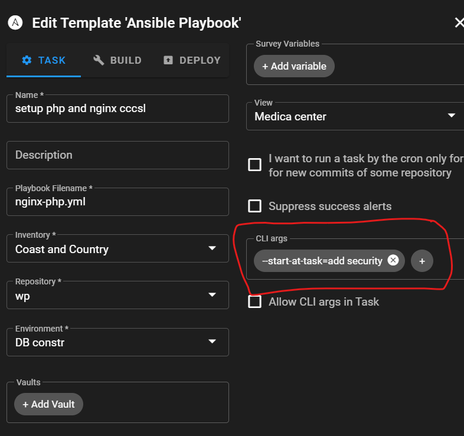

# SSL Certificate
it need to add AAA records in Rout53 and A Record for www and main.

# FTP
it need to open ports:
PORTS:
 1. 21-22
 2. 20000-201000 ( passive mode)

# Steps

1. ngin-php.yml
2. wordpress
3. ssl-certbot.yml
4. cache.yml
5. ftp.yml
6. tools.yml
7. newrelic.yml

# HOW TO START FROM A SPECIAL TASK

