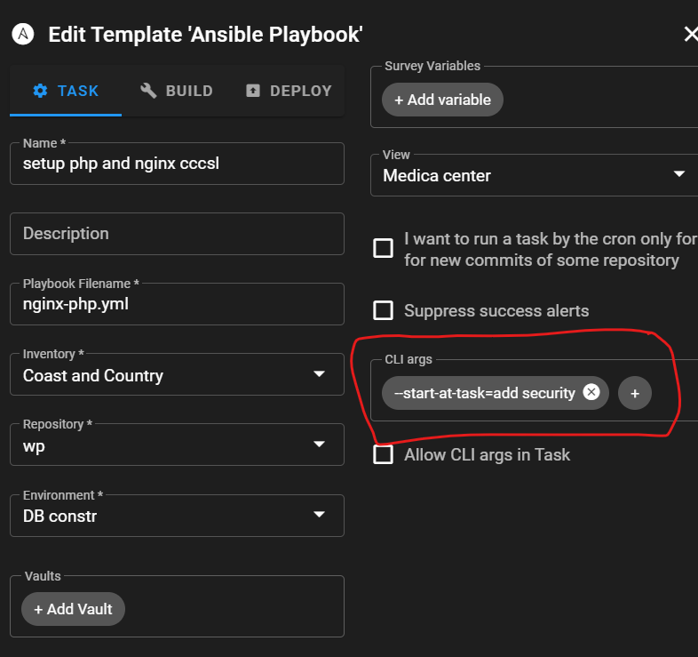

# SSL Certificate
Add **A records** in **Route53** for both the main domain and **www** (e.g. `example.com` and `www.example.com`) pointing to your server’s public IP. **AAAA** (IPv6) is optional. See [docs/ssl-dns-troubleshooting.md](docs/ssl-dns-troubleshooting.md) if Certbot renewal fails with DNS errors; see [ssl-error.log](ssl-error.log) for an example failure log.

# FTP
it need to open ports:
PORTS:
 1. 21-22
 2. 20000-201000 ( passive mode)

# Steps

1. ngin-php.yml
2. wordpress
3. ssl-certbot.yml
4. cache.yml
5. ftp.yml
6. tools.yml
7. newrelic.yml

# Troubleshooting
- **SSL / Certbot:** [docs/ssl-dns-troubleshooting.md](docs/ssl-dns-troubleshooting.md)
- **Firewall & connectivity:** [docs/firewall-connectivity-checklist.md](docs/firewall-connectivity-checklist.md)

# HOW TO START FROM A SPECIAL TASK



```
--start-at-task=
```