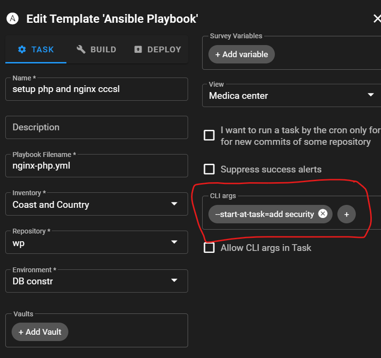

# Lightsail AL2 → AL2023 (AWS CLI)
See [aws-cli/README.md](aws-cli/README.md) for login profiles, Route53, and the migration orchestrator.

# New WordPress site (AL2023 Lightsail)
[`aws-cli/create/al2023-lightsail-wordpress.sh`](aws-cli/create/al2023-lightsail-wordpress.sh) creates a Lightsail instance, opens ports, creates Route53 hosted zones and A/AAAA records, then runs [modules/1_nginx-php/playbook.yml](modules/1_nginx-php/playbook.yml) and [modules/2_wordpress/playbook.yml](modules/2_wordpress/playbook.yml) (prompts for `db_name` and table prefix). Details: [aws-cli/README.md](aws-cli/README.md#create-a-new-wordpress-site).

# SSL Certificate
Add **A records** in **Route53** for both the main domain and **www** (e.g. `example.com` and `www.example.com`) pointing to your server’s public IP. **AAAA** (IPv6) is optional. See [docs/ssl-dns-troubleshooting.md](docs/ssl-dns-troubleshooting.md) if Certbot renewal fails with DNS errors; see [ssl-error.log](ssl-error.log) for an example failure log.

# FTP
it need to open ports:
PORTS:
 1. 21-22
 2. 20000-201000 ( passive mode)

# Steps

1. ngin-php.yml
2. wordpress (includes [module 9](modules/9_backup/README.md) root site backup cron — replaces UpdraftPlus)
3. ssl-certbot.yml
4. cache.yml
5. ftp.yml
6. tools.yml
7. newrelic.yml
8. [WordPress and OS auto-updates](modules/8_updates/README.md)
9. [WordPress site backup](modules/9_backup/README.md) (also deployed by step 2; run standalone for live fleet)

# Troubleshooting
- **SSL / Certbot:** [docs/ssl-dns-troubleshooting.md](docs/ssl-dns-troubleshooting.md)
- **Firewall & connectivity:** [docs/firewall-connectivity-checklist.md](docs/firewall-connectivity-checklist.md)

# HOW TO START FROM A SPECIAL TASK



```
--start-at-task=
```