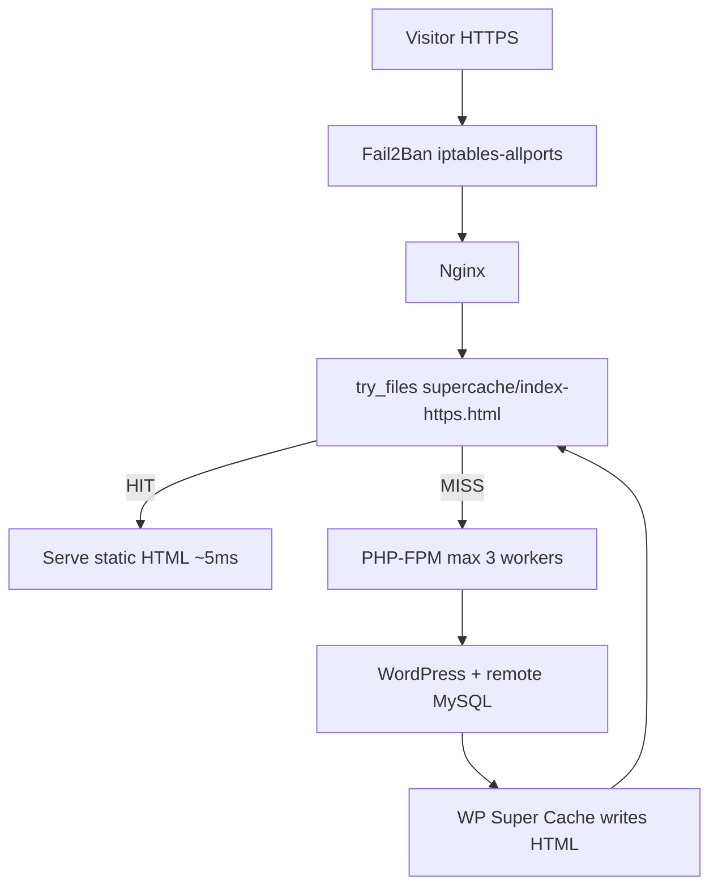

# Life Medical Imaging — incident report, nginx logs & fixes

Guide for [lifeimaging.com.au](https://lifeimaging.com.au/) performance and stability work on the **lifeimaging** server (AWS Lightsail, Amazon Linux 2023, WordPress + Gravity Forms).

**SSH host:** `lifeimaging` (`13.54.18.208`) — see project-root `[ssh-config](../ssh-config)`  
**Stack:** Nginx · PHP-FPM · remote MySQL (`152.69.175.15`) · WP Super Cache · Fail2Ban  
**Doc date:** 2026-06-24

---

## Executive summary

The site was reported **down during high traffic**. Log analysis showed:

- **No full nginx/PHP crash** (no 502/504, services stayed up).
- **Brief real-user impact:** 5× HTTP 503 on content pages (pre-fix, ~04:20 UTC).
- **Heavy bot traffic:** 1,000+ `/wp-login.php` attempts/day, 875+ blocked `xmlrpc.php` 403s.
- **Root cause:** 1 GB RAM host with **only 2 PHP-FPM workers**, **no active swap**, and **no nginx static supercache** — PHP saturated under concurrent load + attacks.

**Fixes applied (24 Jun 2026):** swap, PHP-FPM tuning, WP Super Cache Expert nginx rules, Fail2Ban hardened `jail.local`.

---

## Server profile


| Item     | Value                                           |
| -------- | ----------------------------------------------- |
| Instance | AWS Lightsail (~916 MB RAM, 2 vCPU)             |
| OS       | Amazon Linux 2023                               |
| Web root | `/usr/share/nginx/html`                         |
| DB       | Remote MySQL `152.69.175.15` (no local MariaDB) |
| Domain   | `lifeimaging.com.au` / `www.lifeimaging.com.au` |


---

## Nginx log report

### Log files


| File             | Location                             | Notes         |
| ---------------- | ------------------------------------ | ------------- |
| Access (today)   | `/var/log/nginx/access.log`          | Rotates daily |
| Access (archive) | `/var/log/nginx/access.log-YYYYMMDD` | Plain + `.gz` |
| Error (today)    | `/var/log/nginx/error.log`           |               |
| Error (archive)  | `/var/log/nginx/error.log-YYYYMMDD`  |               |


### Traffic summary — 24 Jun 2026 (partial day, through ~06:50 UTC)


| HTTP status   | Count  | Meaning                               |
| ------------- | ------ | ------------------------------------- |
| **200**       | ~2,983 | Normal                                |
| **403**       | ~1,227 | Blocked attacks (mostly `xmlrpc.php`) |
| **503**       | ~261   | See breakdown below                   |
| **301**       | ~143   | Redirects                             |
| **404**       | ~139   | Missing paths / scans                 |
| **502 / 504** | **0**  | No gateway/upstream failure           |


### Traffic summary — 23 Jun 2026 (full day)


| HTTP status    | Count  |
| -------------- | ------ |
| 200            | 4,992  |
| 403            | 4,102  |
| 503            | 826    |
| Total requests | 10,657 |


Peak requests per hour (23 Jun): **868/hour** (~03:00 UTC).

### HTTP 503 breakdown (important)

503 does **not** always mean the site is down.


| Type                   | Count (24 Jun) | Cause                                                                    |
| ---------------------- | -------------- | ------------------------------------------------------------------------ |
| `**/wp-login.php`**    | ~256           | Nginx `limit_req` on `security_login` zone (2 req/min) — **intentional** |
| **Real content pages** | **5**          | PHP worker saturation — **actual visitor impact**                        |


**Real-user 503 events (all before fixes, ~04:20 UTC):**


| Time (UTC)  | Page                     | Notes                      |
| ----------- | ------------------------ | -------------------------- |
| 04:20:11    | `/`                      | Visitor from Bing          |
| 04:20:28–32 | `/book-online-page/`     | Same visitor, retries      |
| 04:21:19    | `/bateau-bay-radiology/` | Mobile visitor from Google |


Same users received **200** seconds later — brief saturation, not total outage.

**After supercache nginx deploy (05:39 UTC):** all 503s were **wp-login only** — no further content-page 503s in logs.

### Top paths (24 Jun)


| Path                       | Requests | Notes                 |
| -------------------------- | -------- | --------------------- |
| `/wp-login.php`            | ~1,013   | Brute-force / bots    |
| `/xmlrpc.php`              | ~875     | **403 blocked**       |
| `/wp-admin/admin-ajax.php` | ~472     | Admin/editor          |
| `/`                        | ~223     | Homepage              |
| `/bateau-bay-radiology/`   | ~50      | Location page         |
| Referral PDF               | ~158     | Large static download |


### Error log patterns


| Pattern                              | Count (approx) | Severity                                            |
| ------------------------------------ | -------------- | --------------------------------------------------- |
| `limiting requests … security_login` | ~246+          | Expected — login rate limit                         |
| `Primary script unknown`             | ~23            | Exploit scans (`inputs.php`, `ioxi-o.php`, etc.)    |
| `signal process started`             | 2              | Nginx reloads during maintenance (05:24, 05:39 UTC) |
| Upstream timeout / OOM               | **0**          | —                                                   |


### Attack traffic

- Continuous **wp-login** POST floods from many IPs (cloud VPS ranges).
- **xmlrpc.php** blocked at nginx (`return 403`) — 3,615 attempts on 23 Jun.
- Fake PHP shell probes (`inputs.php`, `ioxi-o.php`, `wp-plain.php`) — 404 / “Primary script unknown”.

---

## Architecture (after fixes)




---

## Changes applied

### 1. Swap (1 GB, persistent)

**Problem:** `/swapfile` existed but was **not enabled**; no `/etc/fstab` entry — lost on reboot.

**Actions:**

- `mkswap` + `swapon /swapfile`
- Added `/swapfile none swap sw 0 0` to `/etc/fstab`

**Result:** 1 GB swap active (~2 MB used under normal load).

---

### 2. PHP-FPM tuning

**Problem:** `pm = dynamic`, `pm.max_children = 2` — only 2 concurrent PHP requests on a 1 GB host under bot + visitor load.

**File:** `/etc/php-fpm.d/www.conf`  
**Backup:** `www.conf.bak-lifeimaging-`*


| Setting                               | Before        | After          |
| ------------------------------------- | ------------- | -------------- |
| `pm`                                  | `dynamic`     | `ondemand`     |
| `pm.max_children`                     | 2             | **3**          |
| `pm.process_idle_timeout`             | (default)     | `15s`          |
| `pm.max_requests`                     | 500           | `200`          |
| `php_admin_value[memory_limit]`       | 96M (php.ini) | **96M** (pool) |
| `php_admin_value[max_execution_time]` | —             | **30**         |
| `rlimit_files`                        | —             | `1024`         |


---

### 3. WP Super Cache Expert mode (nginx static delivery)

**Problem:** Plugin was in Expert mode (`$wp_cache_mod_rewrite = 1`) and generating files under `wp-content/cache/supercache/lifeimaging.com.au/`, but nginx still used:

```nginx
try_files $uri $uri/ /index.php?$args;
```

PHP ran on every request — Expert mode ineffective.

**Files added/updated:**


| File                                    | Role                                                                       |
| --------------------------------------- | -------------------------------------------------------------------------- |
| `/etc/nginx/conf.d/supercache-map.conf` | Map `www` → `lifeimaging.com.au` cache host                                |
| `/etc/nginx/default.d/supercache.conf`  | Bypass rules (POST, query string, cookies, admin) + `gzip_static` location |
| `/etc/nginx/nginx.conf`                 | `location /` supercache `try_files`                                        |


**Core `location /` block:**

```nginx
location / {
    try_files /wp-content/cache/supercache/$wpsc_host$wpsc_path/index-https.html
              $uri $uri/ /index.php$is_args$args;
    add_header Cache-Control "public, max-age=3600" always;
}
```

**WP Super Cache PHP** (`wp-content/wp-cache-config.php`):


| Setting                 | Before        | After            |
| ----------------------- | ------------- | ---------------- |
| `$cache_max_time`       | 1800 (30 min) | **86400** (24 h) |
| `$cache_compression`    | 0 → 1         | **1**            |
| `$wp_cache_mod_rewrite` | 1             | 1 (unchanged)    |


**Backups:** `security.conf.bak-supercache-*`, `wp-cache-config.php.bak-supercache-*`

**Verified:** Homepage response byte size matches `index-https.html` cache file; second request served static HTML without PHP.

**Intermediate step (removed):** FastCGI cache on `index.php` was added then **removed** when supercache went live — redundant on 1 GB RAM.


| Removed                    | Path                                           |
| -------------------------- | ---------------------------------------------- |
| FastCGI cache zone         | `/etc/nginx/conf.d/fastcgi_cache_file.conf`    |
| Skip variables             | `/etc/nginx/default.d/fastcgi_cache_skip.conf` |
| `fastcgi_cache` directives | `/etc/nginx/default.d/security.conf`           |


---

### 4. Fail2Ban hardened `jail.local`

**Problem:** Server had minimal Fail2Ban (sshd + `nginx-unknown-script` only). Login brute-forcers got nginx **503** but were **not firewall-banned**.

**Deployed from repo:** `[modules/5_security/files/fail2ban/jail.local](../modules/5_security/files/fail2ban/jail.local)`  
**Backup:** `/etc/fail2ban/jail.local.bak-*`

**Active jails (5):**


| Jail                   | Purpose                                                 |
| ---------------------- | ------------------------------------------------------- |
| `sshd`                 | SSH brute-force                                         |
| `nginx-unknown-script` | PHP exploit scans (`Primary script unknown`)            |
| `**nginx-limit-req`**  | **Bans IPs hitting nginx rate limits (wp-login flood)** |
| `nginx-botsearch`      | phpMyAdmin/webmail/wp probe scans                       |
| `recidive`             | 4-week ban for repeat offenders                         |


**Key `[DEFAULT]` settings:**

- `bantime = 86400` (24 h), exponential escalation to 4 weeks
- `iptables-allports` (block all ports, not just 80/443)
- `bantime.increment = true`, `bantime.overalljails = true`
- `logban` → `/var/log/fail2ban/banned-ips.log`

**Note:** `/var/log/fail2ban/fail2ban.log` had to be created for `recidive` jail to start.

**Existing jail kept:** `/etc/fail2ban/jail.d/nginx-unknown-script.conf`

---

## Current production state (24 Jun 2026)


| Component                        | Status                              |
| -------------------------------- | ----------------------------------- |
| nginx                            | active                              |
| php-fpm                          | active (`ondemand`, max 3 children) |
| fail2ban                         | active (5 jails)                    |
| Swap                             | 1 GB enabled                        |
| Supercache nginx                 | enabled                             |
| Fail2Ban banned (unknown-script) | 12 IPs                              |


---

## Verification commands

```bash
# SSH
ssh -F ssh-config lifeimaging

# Services & memory
systemctl status nginx php-fpm fail2ban
free -h && swapon --show

# Supercache hit (from server)
curl -sI -H "Host: lifeimaging.com.au" https://127.0.0.1/ -k | grep -iE 'HTTP/|cache-control|content-length'

# Fail2Ban
sudo fail2ban-client status
sudo fail2ban-client status nginx-limit-req
sudo tail -20 /var/log/fail2ban/banned-ips.log

# Nginx logs
sudo tail -50 /var/log/nginx/error.log
sudo awk '{c[$9]++} END {for(k in c) print c[k],k}' /var/log/nginx/access.log | sort -rn
```

---

## Rollback notes

Backups on server (timestamps vary):


| Component       | Backup pattern                                                       |
| --------------- | -------------------------------------------------------------------- |
| nginx.conf      | `nginx.conf.bak-supercache-*`                                        |
| security.conf   | `security.conf.bak-supercache-*` / `security.conf.bak-lifeimaging-*` |
| php-fpm         | `www.conf.bak-lifeimaging-*`                                         |
| wp-cache-config | `wp-cache-config.php.bak-supercache-*`                               |
| fail2ban        | `jail.local.bak-*`                                                   |


To rollback supercache only: restore `nginx.conf`, remove `supercache-map.conf` and `supercache.conf`, `nginx -t && systemctl reload nginx`.

---

## Recommendations (not yet done)

- **Upgrade Lightsail** to 2 GB RAM if swap usage stays high under traffic.
- Deploy same supercache + Fail2Ban pattern via Ansible for future hosts (see `[docs/cccsl/cache-optimization.md](cccsl/cache-optimization.md)` as template).
- Update `[modules/5_security/playbook-fail2ban.yml](../modules/5_security/playbook-fail2ban.yml)` inline `jail.local` content to match repo file (playbook still ships old 1-hour `iptables-multiport` config).

---

## Related repo files

- `[modules/5_security/files/fail2ban/jail.local](../modules/5_security/files/fail2ban/jail.local)`
- `[modules/5_security/files/fail2ban/jail/nginx-unknown-script.conf](../modules/5_security/files/fail2ban/jail/nginx-unknown-script.conf)`
- `[configs/nginx-ssl.conf](../configs/nginx-ssl.conf)` — supercache pattern reference
- `[docs/cccsl/cache-optimization.md](cccsl/cache-optimization.md)` — same pattern on cccls
- `[.cursor/plans/lifeimaging_supercache_nginx_c753b130.plan.md](../.cursor/plans/lifeimaging_supercache_nginx_c753b130.plan.md)` — implementation plan

---

*Last updated: 2026-06-24 — reflects production state on `lifeimaging` after log review, capacity fixes, supercache nginx, and Fail2Ban hardening.*